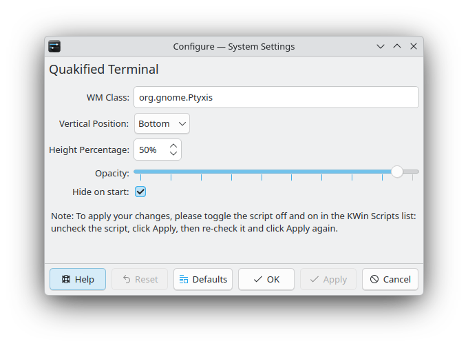

# Quakified Terminal (for KDE)

A KWin script that turns any terminal into a Quake-style dropdown console.

## Overview

**Quakified Terminal** transforms your favorite terminal emulator into a dropdown or slide-up console, inspired by the classic Quake console.

Trying out KDE Plasma for the first time as a Gnome user; I missed [ddterm](https://extensions.gnome.org/extension/3780/ddterm/) the most. Quake-style console is very convinient, letting you access it with a single keypress. Pairing it with `tmux` is a chef's kiss.

I tried `yakuake` but won't let me position at the bottom of the screen. Since windows have title bar at the top, I want to align my console at the bottom of the screen, so I can see and control it easily.

I am surprised that there is no terminal matching my needs on KDE, given that it is famous for its customizability. So I decided to write this KWin script to provide exactly what I want.

## Features

* Toggle the terminal window with a global shortcut key.
* Do not clutter your task bar.
* Works with any terminal emulator by specifying its `WM_CLASS`.
* Opacity control: Adjust window transparency from KWin Settings.

## Installation

There are two subobjectives to achieve the goal.

1. Make the terminal autostart on login.
2. Configure the script to manage the terminal window.

### Prerequisites

- KDE Plasma 6.
- Your favorite terminal emulator.
- Information to gather:
    * To configure the terminal as a startup application, its desktop file have to be located.
    * To link the terminal window with the script, the `WM_CLASS` have to be identified.

#### How to get desktop file location

These files usually reside in `/usr/share/applications/` or `/usr/local/share/applications/` for applications installed system-wide, or `~/.local/share/applications/` for user-specific applications. 
Check these directories out to find where the desktop file of your terminal emulator is located.

#### How to get `WM_CLASS` (aka. App ID)

I assumed you are on Wayland, otherwise you would use something like [Guake](https://guake.github.io/) already.

[Let's ask Gemini](https://gist.github.com/midnight-wonderer/b7c1973ee76d77b63a67d1cec37b1d91).  
In the case the answer is outdated, you could ask your favorite AI with a similar question again. (Assuming they are still around.)

### Setting up

#### Make the terminal autostart on login

Symbolically link the desktop file you located in the previous step to `~/.config/autostart`.

For example:

~~~bash
ln -s /usr/share/applications/org.gnome.Ptyxis.desktop ~/.config/autostart/
# Notice: create the directory if it doesn't exist.
~~~

#### Configure the script to manage the terminal window

* Download `kwinscript` file from our [release page](https://github.com/midnight-wonderer/quakified-terminal/releases).
* Install it via KDE System Settings. `System Settings` > `Window Management` > `KWin Scripts` > `Install From File...` (Or other labels that may vary depending on your language and KDE version.) Choose the downloaded file.
* Enable the script by checking the checkbox next to its name.
* Configure the script by clicking the configure icon next to its name.

Here the preview of the current version:

Importnat: put in the WM Class the value you got from the previous step.

* Once configured, the script must be reloaded manually to apply the changes. See the note on the configuration screen. (AFAIK, there is no official way to listen to the configuration change event for the moment. But this is just one off event, and you won't do this frequently. So, no big deal, IMO.)

* Finally, you have to set up the shortcut key in **System Settings** > **Keyboard** > **Shortcuts** > Search for "Quake", it is probably under the "Window Management" service.

Assign your preferred shortcut key. Mine is `F12`.

Reboot your system to see the full experience, you assigned shortcut key will magically bring up the terminal.

## License

This project is licensed under the [**GPLv3** License](LICENSE.md).
