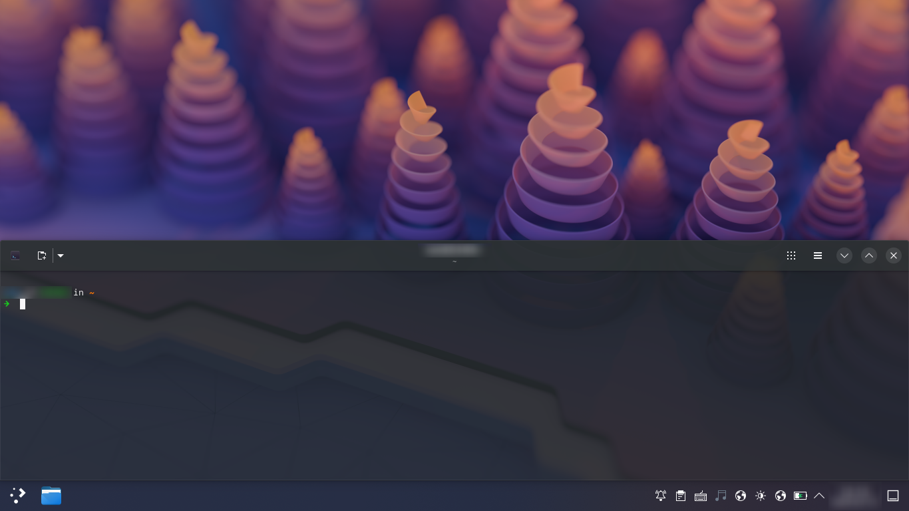

# 🖥️ Quakified Terminal (for KDE)

[](https://store.kde.org/p/2351909)
[](https://github.com/midnight-wonderer/quakified-terminal/releases)
[](LICENSE.md)

A KWin script that turns any terminal emulator into a Quake-style dropdown or slide-up console.



> [!NOTE]
> The screenshot features a specific terminal emulator, but the script is compatible with any terminal of your choice.

## ✨ Features

* 🌍 **Universal Compatibility**: Works with any terminal emulator by specifying its `WM_CLASS`.
* 💠 **Wayland Native**: Designed to work seamlessly on Wayland environments.
* ⚡ **Global Shortcut**: Toggle the terminal window instantly with a single keypress.
* 🎯 **Custom Placement**: Align the console at the bottom, or top of the screen.
* 🧹 **Declutter**: Keeps the icon of your terminal out of the taskbar.
* 👻 **Opacity Control**: Adjust window transparency directly from KWin Settings.
* 🧩 **Pure KWin Script**: No extra dependencies.

## 🛠️ Installation and Setup

Getting started involves installing the script, configuring it for your preferred terminal, setting your terminal to autostart, and assigning a shortcut.

### 1. 📦 Install the KWin Script

1. Open **System Settings** > **Window Management** > **KWin Scripts**.
2. Install the script using one of these methods:
   - **Recommended**: Click **Get New...**, search for **"Quakified Terminal"**, and click **Install**.
   - **Manual**: Download the `.kwinscript` from the [releases page](https://github.com/midnight-wonderer/quakified-terminal/releases), click **Install From File...**, and select the downloaded file.
3. Enable the script by checking the checkbox next to its name.

> [!NOTE]
> Labels may vary slightly depending on your KDE version.

> [!TIP]
> To ensure you're getting a secure and authentic build, you can check the [GitHub Attestations](https://github.com/midnight-wonderer/quakified-terminal/attestations).

### 2. ⚙️ Configure the Script

To manage your terminal, the script needs to know the terminal's App ID (`WM_CLASS`). 

1. **Find the `WM_CLASS`**: If you are on Wayland, you can use [this guide](https://gist.github.com/midnight-wonderer/b7c1973ee76d77b63a67d1cec37b1d91) to discover the App ID of your terminal.
2. Click the configure icon near the script name in KWin Scripts.
3. Enter the terminal's `WM_CLASS` value, and configure other settings as you please.

> [!NOTE]
> The script must be manually reloaded after applying configuration changes. Simply uncheck the script, click apply, re-check it, and click apply again.


### 3. 🚘 Autostart Your Terminal

> [!IMPORTANT]
> The script controls an existing terminal window; it does not launch one. You need to configure your terminal to start on login.

1. Locate your terminal's `.desktop` file. These are usually found in `/usr/share/applications/`, `/usr/local/share/applications/`, or `~/.local/share/applications/`.
2. Create a symbolic link to this file in your autostart directory.

```bash
mkdir -p ~/.config/autostart
ln -s /usr/share/applications/org.gnome.Ptyxis.desktop ~/.config/autostart/
```

### 4. ⌨️ Set the Global Shortcut

1. Go to **System Settings** > **Keyboard** > **Shortcuts**.
2. Search for "Quake" (it is usually located under the "Window Management" service).
3. Assign your preferred shortcut key (e.g., `F12`).

> [!TIP]
> Reboot your system. Your chosen shortcut key will now magically bring up the terminal!

## 🔥 Motivation

As a long-time GNOME user transitioning to KDE Plasma, what I missed most was [ddterm](https://extensions.gnome.org/extension/3780/ddterm/). A Quake-style console is incredibly convenient, offering instant access with a single keypress. Pairing it with `tmux` is a chef's kiss.

While KDE has `yakuake`, it restricts the console strictly to the top of the screen. Because most windows have title bars at the top, I prefer my console aligned at the bottom where it won't overlap essential UI elements. Surprisingly, I couldn't find a terminal on KDE that matched this need, despite its reputation for customizability. Consequently, I decided to write this KWin script to provide exactly what I wanted.

## 📜 License

This project is licensed under the [**GPLv3** License](LICENSE.md).
